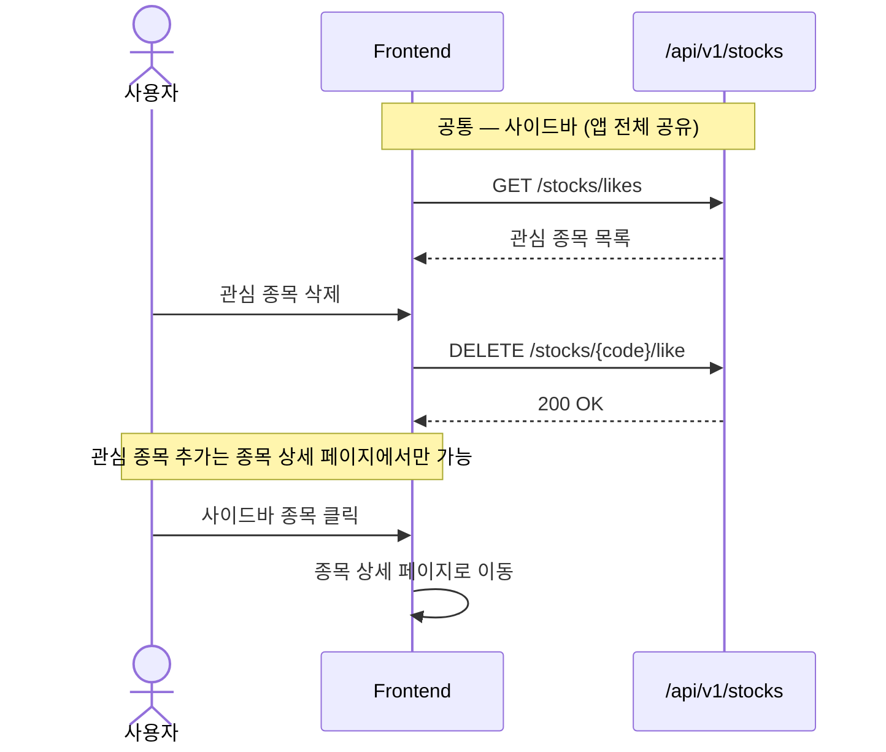
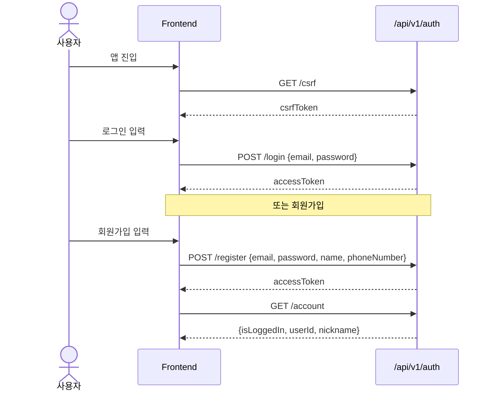
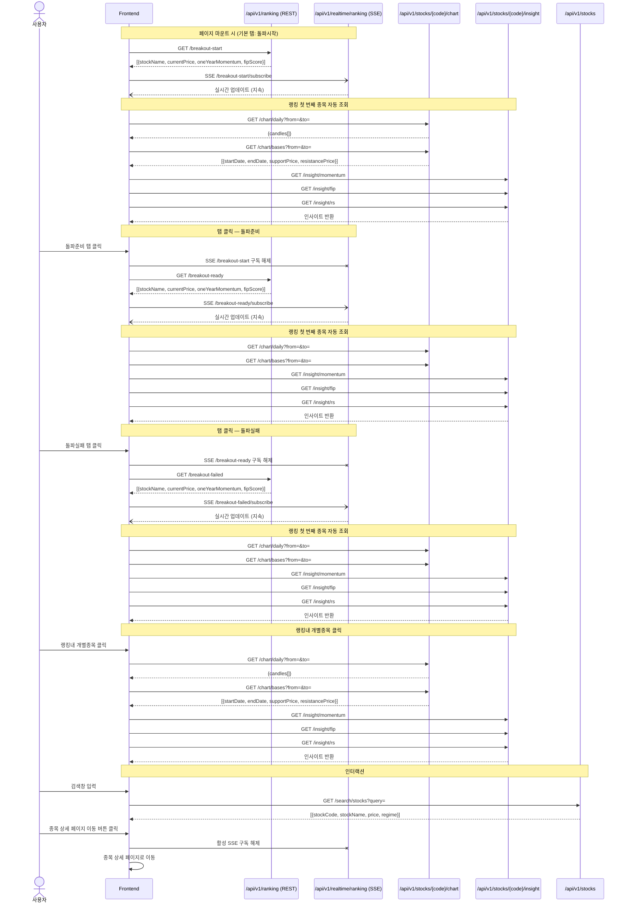
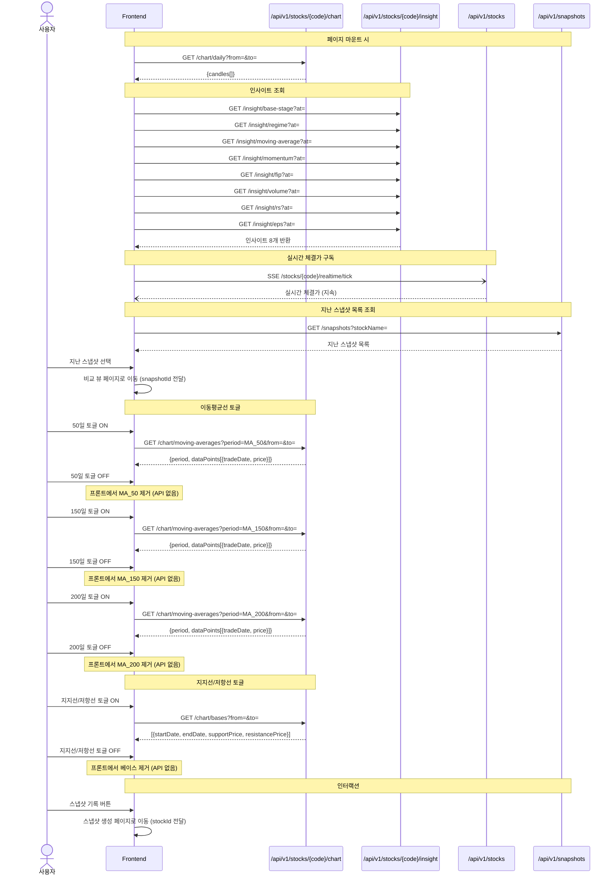
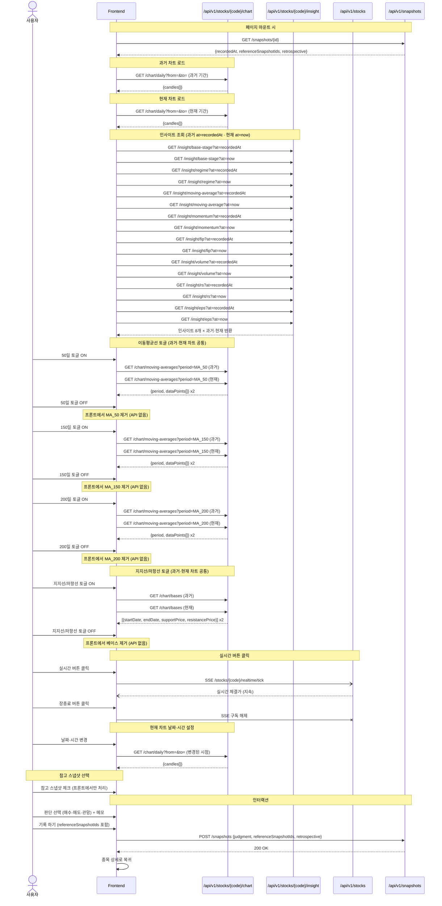
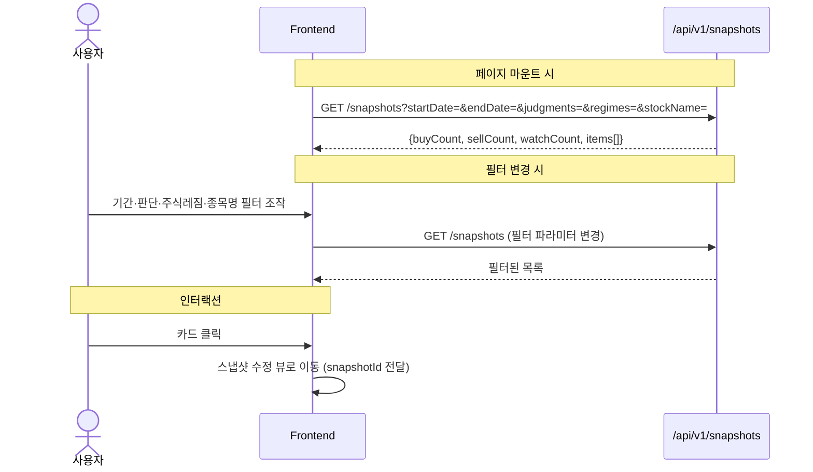
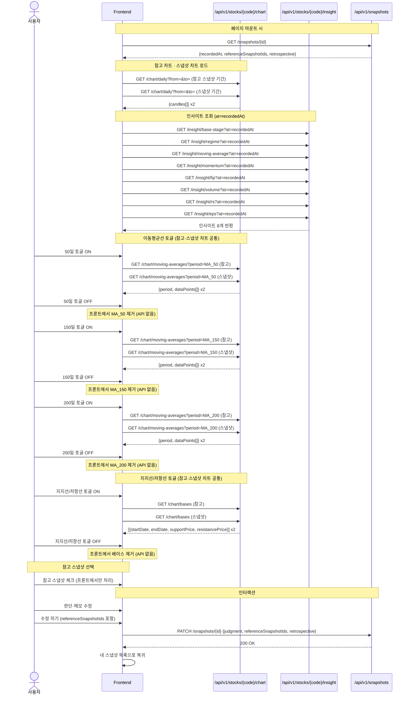

# Momentum 시퀀스 다이어그램

---

## 공통 — 사이드바

```mermaid
sequenceDiagram
    actor U as 사용자
    participant FE as Frontend
    participant STOCK as /api/v1/stocks

    Note over FE,STOCK: 공통 — 사이드바 (앱 전체 공유)
    FE->>STOCK: GET /stocks/likes
    STOCK-->>FE: 관심 종목 목록

    U->>FE: 관심 종목 삭제
    FE->>STOCK: DELETE /stocks/{code}/like
    STOCK-->>FE: 200 OK

    Note over U,FE: 관심 종목 추가는 종목 상세 페이지에서만 가능

    U->>FE: 사이드바 종목 클릭
    FE->>FE: 종목 상세 페이지로 이동
```

---

## 1. 인증

```mermaid
sequenceDiagram
    actor U as 사용자
    participant FE as Frontend
    participant AUTH as /api/v1/auth

    U->>FE: 앱 진입
    FE->>AUTH: GET /csrf
    AUTH-->>FE: csrfToken

    U->>FE: 로그인 입력
    FE->>AUTH: POST /login {email, password}
    AUTH-->>FE: accessToken

    Note over FE,AUTH: 또는 회원가입
    U->>FE: 회원가입 입력
    FE->>AUTH: POST /register {email, password, name, phoneNumber}
    AUTH-->>FE: accessToken

    FE->>AUTH: GET /account
    AUTH-->>FE: {isLoggedIn, userId, nickname}
```

---

## 2. 오늘의 추세

```mermaid
sequenceDiagram
    actor U as 사용자
    participant FE as Frontend
    participant RANK_REST as /api/v1/ranking (REST)
    participant RANK_SSE as /api/v1/realtime/ranking (SSE)
    participant CHART as /api/v1/stocks/{code}/chart
    participant INSIGHT as /api/v1/stocks/{code}/insight
    participant STOCK as /api/v1/stocks

    Note over FE,RANK_SSE: 페이지 마운트 시 (기본 탭: 돌파시작)
    FE->>RANK_REST: GET /breakout-start
    RANK_REST-->>FE: [{stockName, currentPrice, oneYearMomentum, fipScore}]
    FE-)RANK_SSE: SSE /breakout-start/subscribe
    RANK_SSE--)FE: 실시간 업데이트 (지속)

    Note over FE,INSIGHT: 랭킹 첫 번째 종목 자동 조회
    FE->>CHART: GET /chart/daily?from=&to=
    CHART-->>FE: {candles[]}
    FE->>CHART: GET /chart/bases?from=&to=
    CHART-->>FE: [{startDate, endDate, supportPrice, resistancePrice}]
    FE->>INSIGHT: GET /insight/momentum
    FE->>INSIGHT: GET /insight/fip
    FE->>INSIGHT: GET /insight/rs
    INSIGHT-->>FE: 인사이트 반환

    Note over FE,RANK_SSE: 탭 클릭 — 돌파준비
    U->>FE: 돌파준비 탭 클릭
    FE-xRANK_SSE: SSE /breakout-start 구독 해제
    FE->>RANK_REST: GET /breakout-ready
    RANK_REST-->>FE: [{stockName, currentPrice, oneYearMomentum, fipScore}]
    FE-)RANK_SSE: SSE /breakout-ready/subscribe
    RANK_SSE--)FE: 실시간 업데이트 (지속)
    Note over FE,INSIGHT: 랭킹 첫 번째 종목 자동 조회
    FE->>CHART: GET /chart/daily?from=&to=
    FE->>CHART: GET /chart/bases?from=&to=
    FE->>INSIGHT: GET /insight/momentum
    FE->>INSIGHT: GET /insight/fip
    FE->>INSIGHT: GET /insight/rs
    INSIGHT-->>FE: 인사이트 반환

    Note over FE,RANK_SSE: 탭 클릭 — 돌파실패
    U->>FE: 돌파실패 탭 클릭
    FE-xRANK_SSE: SSE /breakout-ready 구독 해제
    FE->>RANK_REST: GET /breakout-failed
    RANK_REST-->>FE: [{stockName, currentPrice, oneYearMomentum, fipScore}]
    FE-)RANK_SSE: SSE /breakout-failed/subscribe
    RANK_SSE--)FE: 실시간 업데이트 (지속)
    Note over FE,INSIGHT: 랭킹 첫 번째 종목 자동 조회
    FE->>CHART: GET /chart/daily?from=&to=
    FE->>CHART: GET /chart/bases?from=&to=
    FE->>INSIGHT: GET /insight/momentum
    FE->>INSIGHT: GET /insight/fip
    FE->>INSIGHT: GET /insight/rs
    INSIGHT-->>FE: 인사이트 반환

    Note over FE,INSIGHT: 랭킹내 개별종목 클릭
    U->>FE: 랭킹내 개별종목 클릭
    FE->>CHART: GET /chart/daily?from=&to=
    CHART-->>FE: {candles[]}
    FE->>CHART: GET /chart/bases?from=&to=
    CHART-->>FE: [{startDate, endDate, supportPrice, resistancePrice}]
    FE->>INSIGHT: GET /insight/momentum
    FE->>INSIGHT: GET /insight/fip
    FE->>INSIGHT: GET /insight/rs
    INSIGHT-->>FE: 인사이트 반환

    Note over FE,STOCK: 인터랙션
    U->>FE: 검색창 입력
    FE->>STOCK: GET /search/stocks?query=
    STOCK-->>FE: [{stockCode, stockName, price, regime}]

    U->>FE: 종목 상세 페이지 이동 버튼 클릭
    FE-xRANK_SSE: 활성 SSE 구독 해제
    FE->>FE: 종목 상세 페이지로 이동
```

---

## 3. 종목 상세

```mermaid
sequenceDiagram
    actor U as 사용자
    participant FE as Frontend
    participant CHART as /api/v1/stocks/{code}/chart
    participant INSIGHT as /api/v1/stocks/{code}/insight
    participant STOCK as /api/v1/stocks
    participant SNAP as /api/v1/snapshots

    Note over FE,SNAP: 페이지 마운트 시
    FE->>CHART: GET /chart/daily?from=&to=
    CHART-->>FE: {candles[]}

    Note over FE,INSIGHT: 인사이트 조회
    FE->>INSIGHT: GET /insight/base-stage?at=
    FE->>INSIGHT: GET /insight/regime?at=
    FE->>INSIGHT: GET /insight/moving-average?at=
    FE->>INSIGHT: GET /insight/momentum?at=
    FE->>INSIGHT: GET /insight/fip?at=
    FE->>INSIGHT: GET /insight/volume?at=
    FE->>INSIGHT: GET /insight/rs?at=
    FE->>INSIGHT: GET /insight/eps?at=
    INSIGHT-->>FE: 인사이트 8개 반환

    Note over FE,STOCK: 실시간 체결가 구독
    FE-)STOCK: SSE /stocks/{code}/realtime/tick
    STOCK--)FE: 실시간 체결가 (지속)

    Note over FE,SNAP: 지난 스냅샷 목록 조회
    FE->>SNAP: GET /snapshots?stockName=
    SNAP-->>FE: 지난 스냅샷 목록
    U->>FE: 지난 스냅샷 선택
    FE->>FE: 비교 뷰 페이지로 이동 (snapshotId 전달)

    Note over FE,CHART: 이동평균선 토글
    U->>FE: 50일 토글 ON
    FE->>CHART: GET /chart/moving-averages?period=MA_50&from=&to=
    CHART-->>FE: {period, dataPoints[{tradeDate, price}]}
    U->>FE: 50일 토글 OFF
    Note over FE: 프론트에서 MA_50 제거 (API 없음)

    U->>FE: 150일 토글 ON
    FE->>CHART: GET /chart/moving-averages?period=MA_150&from=&to=
    CHART-->>FE: {period, dataPoints[{tradeDate, price}]}
    U->>FE: 150일 토글 OFF
    Note over FE: 프론트에서 MA_150 제거 (API 없음)

    U->>FE: 200일 토글 ON
    FE->>CHART: GET /chart/moving-averages?period=MA_200&from=&to=
    CHART-->>FE: {period, dataPoints[{tradeDate, price}]}
    U->>FE: 200일 토글 OFF
    Note over FE: 프론트에서 MA_200 제거 (API 없음)

    Note over FE,CHART: 지지선/저항선 토글
    U->>FE: 지지선/저항선 토글 ON
    FE->>CHART: GET /chart/bases?from=&to=
    CHART-->>FE: [{startDate, endDate, supportPrice, resistancePrice}]
    U->>FE: 지지선/저항선 토글 OFF
    Note over FE: 프론트에서 베이스 제거 (API 없음)

    Note over FE,SNAP: 인터랙션
    U->>FE: 스냅샷 기록 버튼
    FE->>FE: 스냅샷 생성 페이지로 이동 (stockId 전달)
```

---

## 4. 스냅샷 생성

```mermaid
sequenceDiagram
    actor U as 사용자
    participant FE as Frontend
    participant CHART as /api/v1/stocks/{code}/chart
    participant INSIGHT as /api/v1/stocks/{code}/insight
    participant STOCK as /api/v1/stocks
    participant SNAP as /api/v1/snapshots

    Note over FE,SNAP: 페이지 마운트 시
    FE->>SNAP: GET /snapshots/{id}
    SNAP-->>FE: {recordedAt, referenceSnapshotIds, retrospective}

    Note over FE,CHART: 과거 차트 로드
    FE->>CHART: GET /chart/daily?from=&to= (과거 기간)
    CHART-->>FE: {candles[]}

    Note over FE,CHART: 현재 차트 로드
    FE->>CHART: GET /chart/daily?from=&to= (현재 기간)
    CHART-->>FE: {candles[]}

    Note over FE,INSIGHT: 인사이트 조회 (과거 at=recordedAt · 현재 at=now)
    FE->>INSIGHT: GET /insight/base-stage?at=recordedAt
    FE->>INSIGHT: GET /insight/base-stage?at=now
    FE->>INSIGHT: GET /insight/regime?at=recordedAt
    FE->>INSIGHT: GET /insight/regime?at=now
    FE->>INSIGHT: GET /insight/moving-average?at=recordedAt
    FE->>INSIGHT: GET /insight/moving-average?at=now
    FE->>INSIGHT: GET /insight/momentum?at=recordedAt
    FE->>INSIGHT: GET /insight/momentum?at=now
    FE->>INSIGHT: GET /insight/fip?at=recordedAt
    FE->>INSIGHT: GET /insight/fip?at=now
    FE->>INSIGHT: GET /insight/volume?at=recordedAt
    FE->>INSIGHT: GET /insight/volume?at=now
    FE->>INSIGHT: GET /insight/rs?at=recordedAt
    FE->>INSIGHT: GET /insight/rs?at=now
    FE->>INSIGHT: GET /insight/eps?at=recordedAt
    FE->>INSIGHT: GET /insight/eps?at=now
    INSIGHT-->>FE: 인사이트 8개 × 과거·현재 반환

    Note over FE,CHART: 이동평균선 토글 (과거·현재 차트 공통)
    U->>FE: 50일 토글 ON
    FE->>CHART: GET /chart/moving-averages?period=MA_50 (과거)
    FE->>CHART: GET /chart/moving-averages?period=MA_50 (현재)
    CHART-->>FE: {period, dataPoints[]} x2
    U->>FE: 50일 토글 OFF
    Note over FE: 프론트에서 MA_50 제거 (API 없음)

    U->>FE: 150일 토글 ON
    FE->>CHART: GET /chart/moving-averages?period=MA_150 (과거)
    FE->>CHART: GET /chart/moving-averages?period=MA_150 (현재)
    CHART-->>FE: {period, dataPoints[]} x2
    U->>FE: 150일 토글 OFF
    Note over FE: 프론트에서 MA_150 제거 (API 없음)

    U->>FE: 200일 토글 ON
    FE->>CHART: GET /chart/moving-averages?period=MA_200 (과거)
    FE->>CHART: GET /chart/moving-averages?period=MA_200 (현재)
    CHART-->>FE: {period, dataPoints[]} x2
    U->>FE: 200일 토글 OFF
    Note over FE: 프론트에서 MA_200 제거 (API 없음)

    Note over FE,CHART: 지지선/저항선 토글 (과거·현재 차트 공통)
    U->>FE: 지지선/저항선 토글 ON
    FE->>CHART: GET /chart/bases (과거)
    FE->>CHART: GET /chart/bases (현재)
    CHART-->>FE: [{startDate, endDate, supportPrice, resistancePrice}] x2
    U->>FE: 지지선/저항선 토글 OFF
    Note over FE: 프론트에서 베이스 제거 (API 없음)

    Note over FE,STOCK: 실시간 버튼 클릭
    U->>FE: 실시간 버튼 클릭
    FE-)STOCK: SSE /stocks/{code}/realtime/tick
    STOCK--)FE: 실시간 체결가 (지속)
    U->>FE: 장종료 버튼 클릭
    FE-xSTOCK: SSE 구독 해제

    Note over FE,CHART: 현재 차트 날짜·시간 설정
    U->>FE: 날짜·시간 변경
    FE->>CHART: GET /chart/daily?from=&to= (변경된 시점)
    CHART-->>FE: {candles[]}

    Note over U,FE: 참고 스냅샷 선택
    U->>FE: 참고 스냅샷 체크 (프론트에서만 처리)

    Note over FE,SNAP: 인터랙션
    U->>FE: 판단 선택 (매수·매도·관망) + 메모
    U->>FE: 기록 하기 (referenceSnapshotIds 포함)
    FE->>SNAP: POST /snapshots {judgment, referenceSnapshotIds, retrospective}
    SNAP-->>FE: 200 OK
    FE->>FE: 종목 상세로 복귀
```

---

## 5. 내 스냅샷 목록

```mermaid
sequenceDiagram
    actor U as 사용자
    participant FE as Frontend
    participant SNAP as /api/v1/snapshots

    Note over FE,SNAP: 페이지 마운트 시
    FE->>SNAP: GET /snapshots?startDate=&endDate=&judgments=&regimes=&stockName=
    SNAP-->>FE: {buyCount, sellCount, watchCount, items[]}

    Note over FE,SNAP: 필터 변경 시
    U->>FE: 기간·판단·주식레짐·종목명 필터 조작
    FE->>SNAP: GET /snapshots (필터 파라미터 변경)
    SNAP-->>FE: 필터된 목록

    Note over U,FE: 인터랙션
    U->>FE: 카드 클릭
    FE->>FE: 스냅샷 수정 뷰로 이동 (snapshotId 전달)
```

---

## 6. 스냅샷 조회 & 수정

```mermaid
sequenceDiagram
    actor U as 사용자
    participant FE as Frontend
    participant CHART as /api/v1/stocks/{code}/chart
    participant INSIGHT as /api/v1/stocks/{code}/insight
    participant SNAP as /api/v1/snapshots

    Note over FE,SNAP: 페이지 마운트 시
    FE->>SNAP: GET /snapshots/{id}
    SNAP-->>FE: {recordedAt, referenceSnapshotIds, retrospective}

    Note over FE,CHART: 참고 차트 · 스냅샷 차트 로드
    FE->>CHART: GET /chart/daily?from=&to= (참고 스냅샷 기간)
    FE->>CHART: GET /chart/daily?from=&to= (스냅샷 기간)
    CHART-->>FE: {candles[]} x2

    Note over FE,INSIGHT: 인사이트 조회 (at=recordedAt)
    FE->>INSIGHT: GET /insight/base-stage?at=recordedAt
    FE->>INSIGHT: GET /insight/regime?at=recordedAt
    FE->>INSIGHT: GET /insight/moving-average?at=recordedAt
    FE->>INSIGHT: GET /insight/momentum?at=recordedAt
    FE->>INSIGHT: GET /insight/fip?at=recordedAt
    FE->>INSIGHT: GET /insight/volume?at=recordedAt
    FE->>INSIGHT: GET /insight/rs?at=recordedAt
    FE->>INSIGHT: GET /insight/eps?at=recordedAt
    INSIGHT-->>FE: 인사이트 8개 반환

    Note over FE,CHART: 이동평균선 토글 (참고·스냅샷 차트 공통)
    U->>FE: 50일 토글 ON
    FE->>CHART: GET /chart/moving-averages?period=MA_50 (참고)
    FE->>CHART: GET /chart/moving-averages?period=MA_50 (스냅샷)
    CHART-->>FE: {period, dataPoints[]} x2
    U->>FE: 50일 토글 OFF
    Note over FE: 프론트에서 MA_50 제거 (API 없음)

    U->>FE: 150일 토글 ON
    FE->>CHART: GET /chart/moving-averages?period=MA_150 (참고)
    FE->>CHART: GET /chart/moving-averages?period=MA_150 (스냅샷)
    CHART-->>FE: {period, dataPoints[]} x2
    U->>FE: 150일 토글 OFF
    Note over FE: 프론트에서 MA_150 제거 (API 없음)

    U->>FE: 200일 토글 ON
    FE->>CHART: GET /chart/moving-averages?period=MA_200 (참고)
    FE->>CHART: GET /chart/moving-averages?period=MA_200 (스냅샷)
    CHART-->>FE: {period, dataPoints[]} x2
    U->>FE: 200일 토글 OFF
    Note over FE: 프론트에서 MA_200 제거 (API 없음)

    Note over FE,CHART: 지지선/저항선 토글 (참고·스냅샷 차트 공통)
    U->>FE: 지지선/저항선 토글 ON
    FE->>CHART: GET /chart/bases (참고)
    FE->>CHART: GET /chart/bases (스냅샷)
    CHART-->>FE: [{startDate, endDate, supportPrice, resistancePrice}] x2
    U->>FE: 지지선/저항선 토글 OFF
    Note over FE: 프론트에서 베이스 제거 (API 없음)

    Note over U,FE: 참고 스냅샷 선택
    U->>FE: 참고 스냅샷 체크 (프론트에서만 처리)

    Note over FE,SNAP: 인터랙션
    U->>FE: 판단·메모 수정
    U->>FE: 수정 하기 (referenceSnapshotIds 포함)
    FE->>SNAP: PATCH /snapshots/{id} {judgment, referenceSnapshotIds, retrospective}
    SNAP-->>FE: 200 OK
    FE->>FE: 내 스냅샷 목록으로 복귀
```
