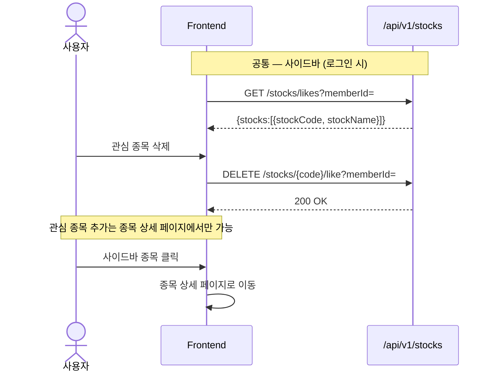
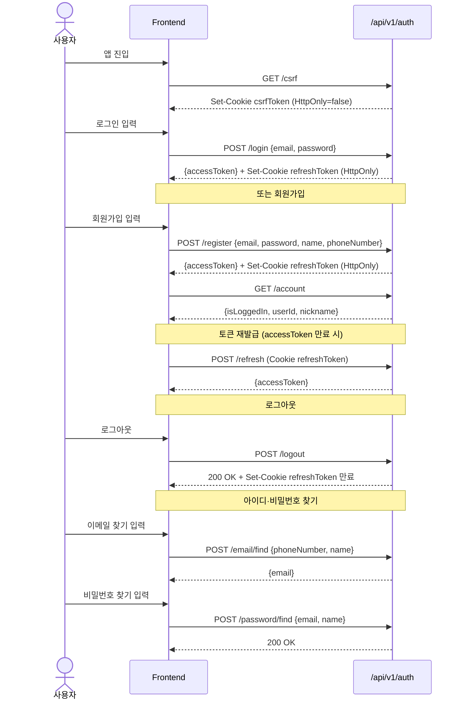
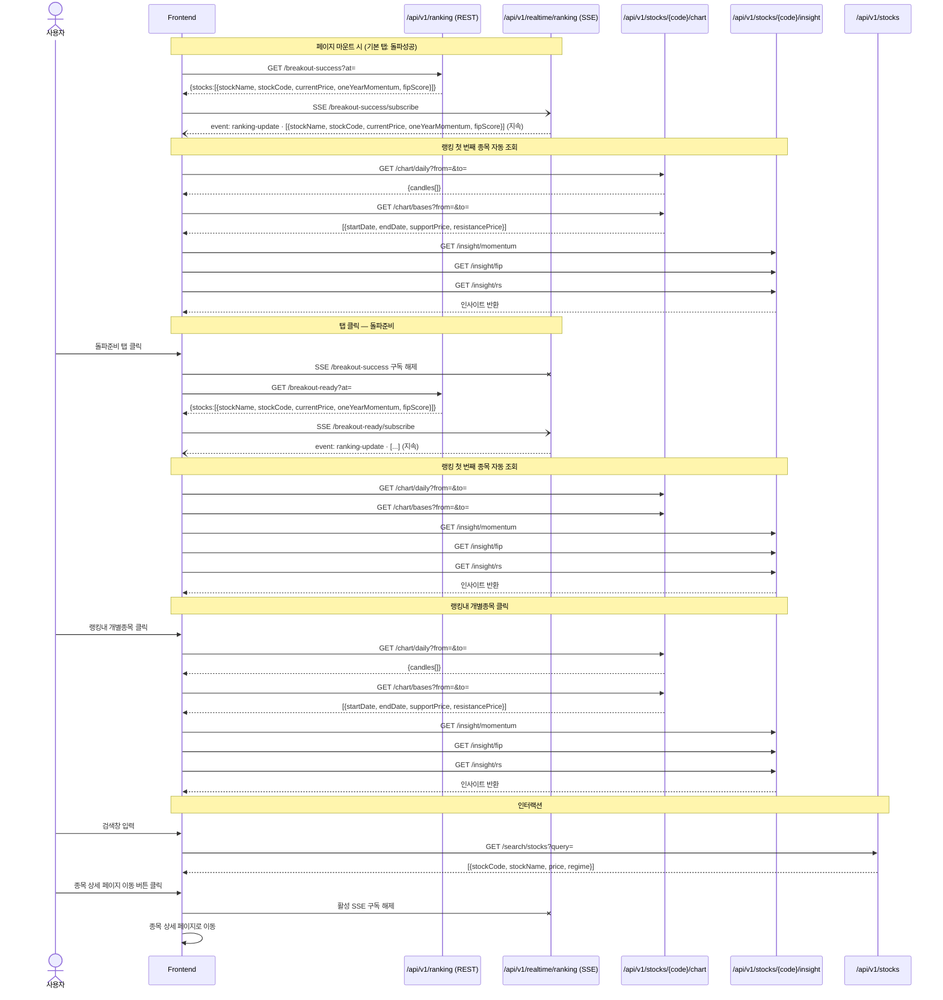
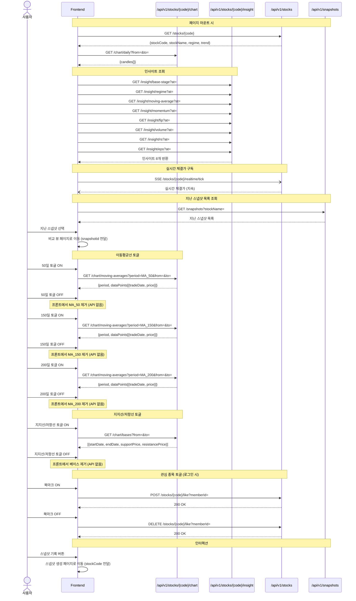
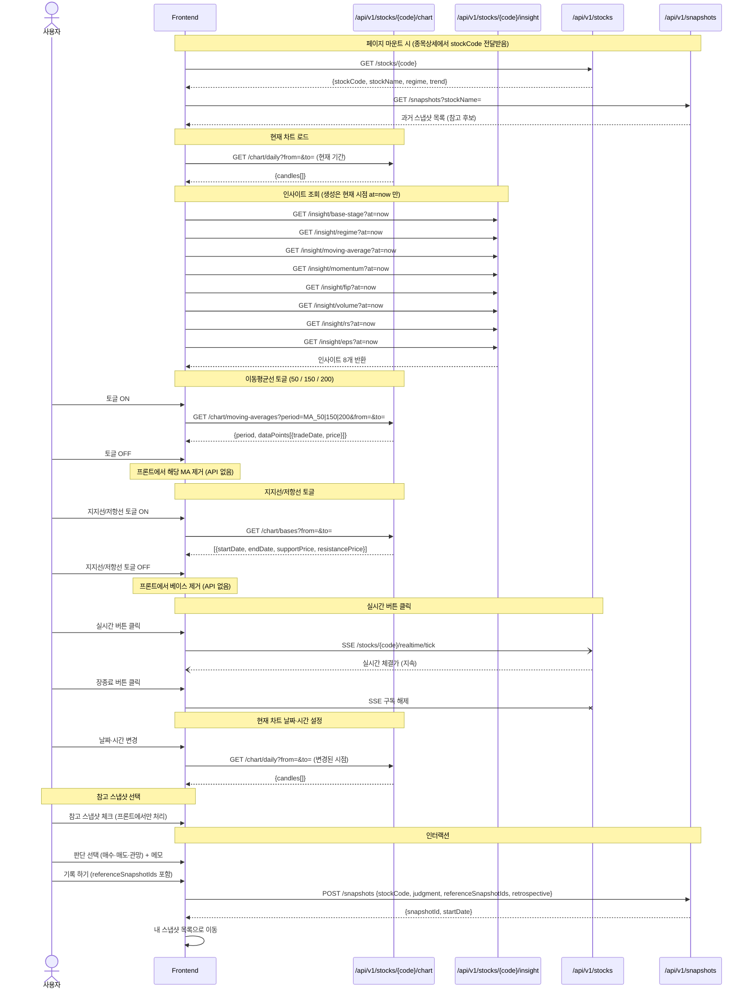
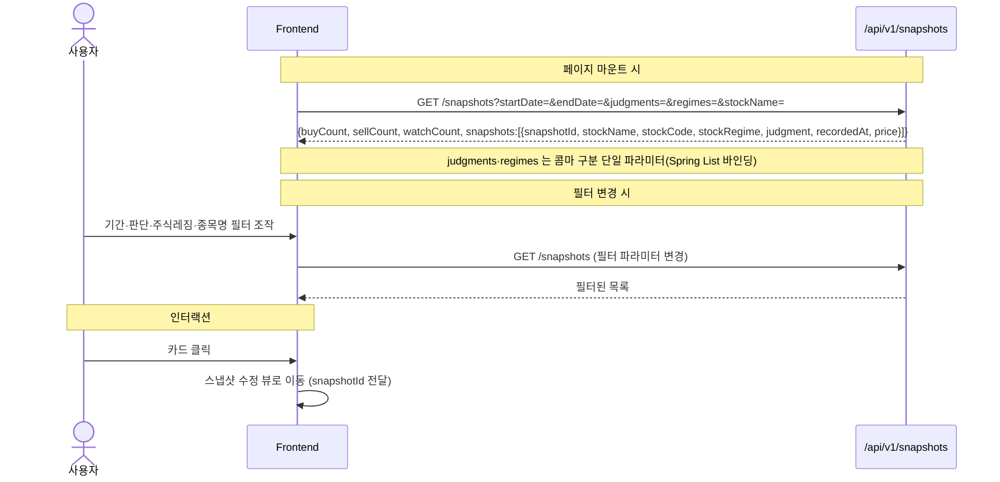
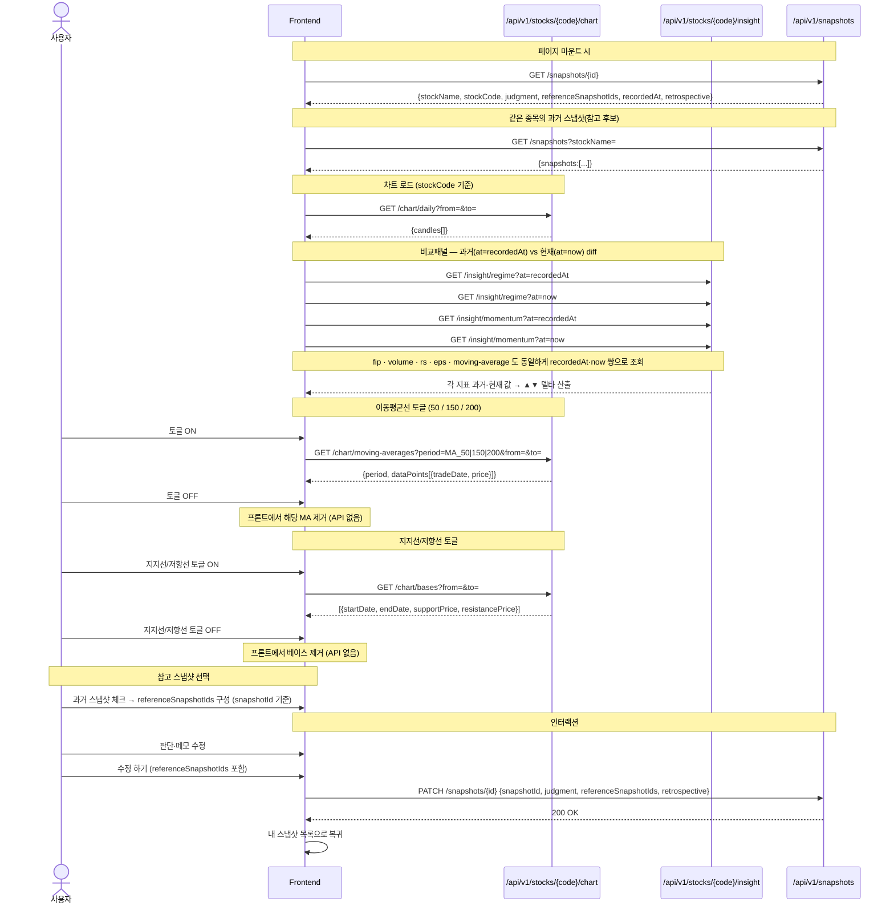

# Momentum 시퀀스 다이어그램

> 최종 갱신: 2026-06-08 (구현된 백엔드 API 기준)

## 0. 공통 규약

- **응답 래퍼**: 모든 REST 응답은 `ApiResponse<T> = { meta:{result, errorCode, message}, data }`. 아래 다이어그램의 응답은 `data` 부분만 표기.
- **인증**: accessToken 은 `Authorization: Bearer` 헤더(메모리 보관), refreshToken 은 HttpOnly 쿠키. `POST /auth/login·refresh·logout` 만 CSRF 필요(쿠키 `csrfToken` ↔ 헤더 `X-CSRF-Token`).
- **base URL**: REST·SSE 모두 `/api/...`. 단 실시간(SSE)은 별도 앱 **stock-realtime(:8081)**, 그 외는 **stock-api(:8080)**.
- **관심종목**: 현재 명세상 `memberId` 를 쿼리 파라미터로 받음(로그인 계정 userId).
- **시점 파라미터** `at` 은 `LocalDateTime`(타임존 없음), 차트 `from`=LocalDate / `to`=LocalDateTime.

---

## 공통 — 사이드바

---

## 1. 인증

---

## 2. 오늘의 추세

---

## 3. 종목 상세

---

## 4. 스냅샷 생성

---

## 5. 내 스냅샷 목록

---

## 6. 스냅샷 조회 & 수정

